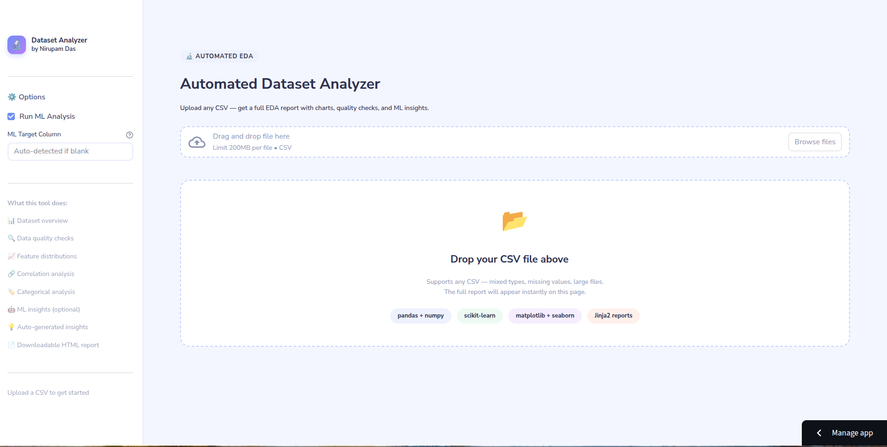
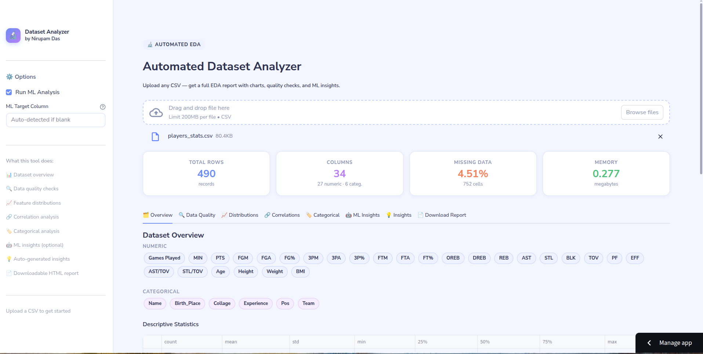
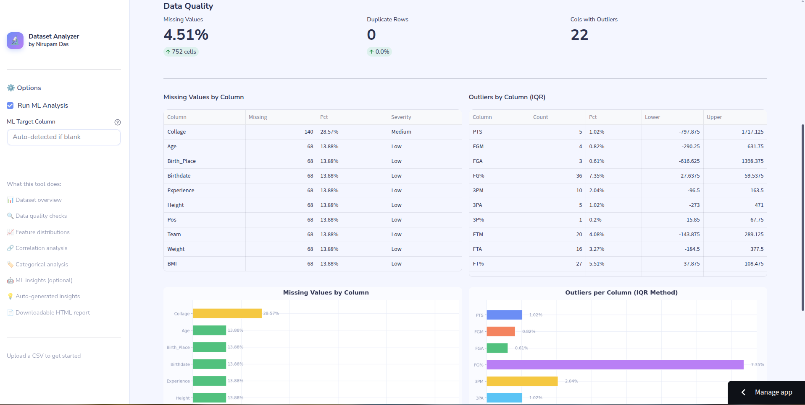
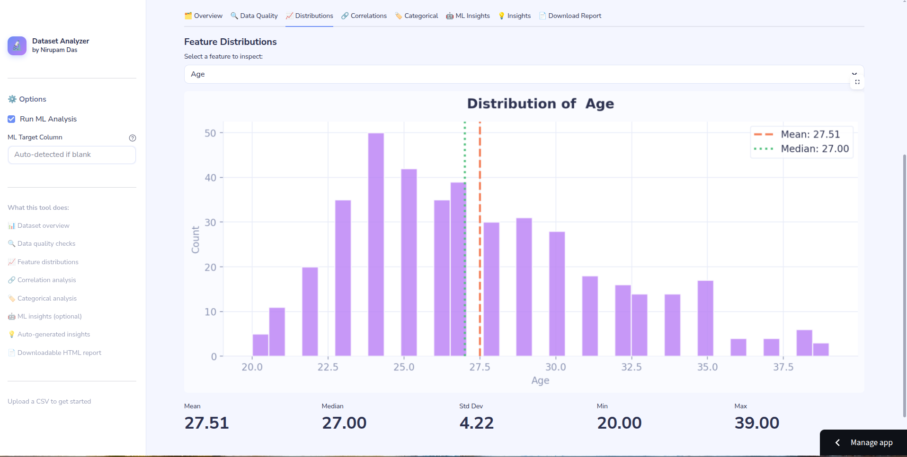
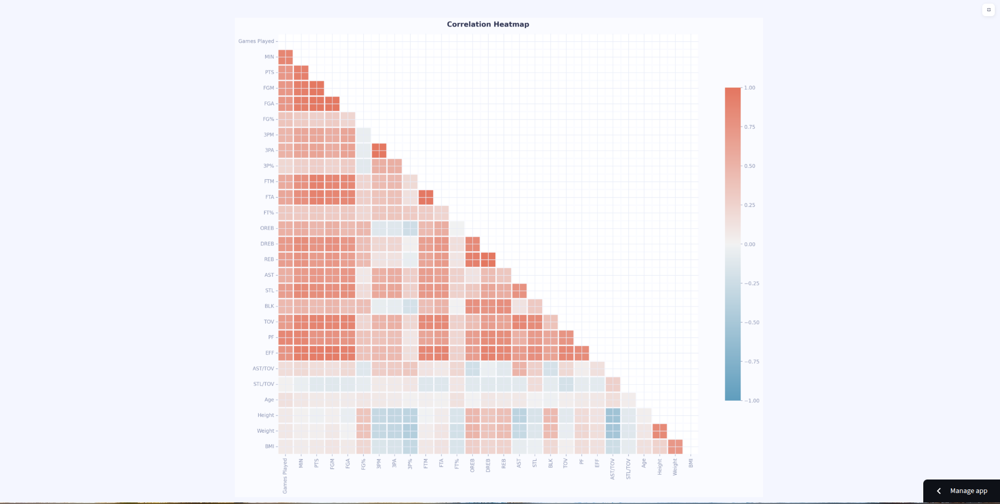
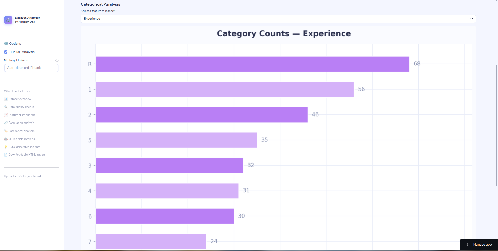
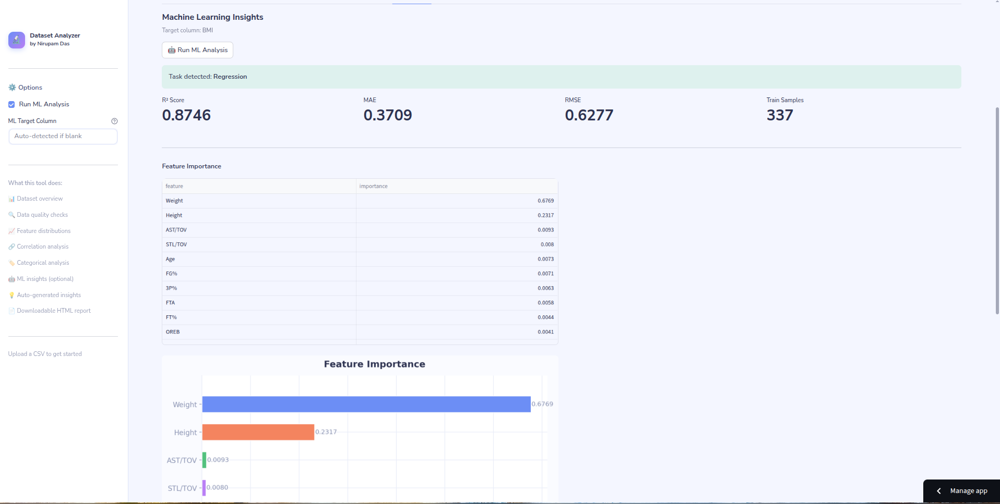
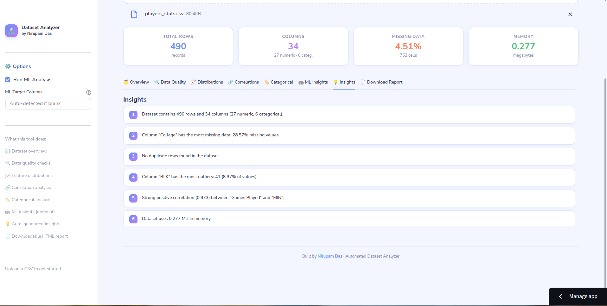

<div align="center">

# 🔬 Automated Dataset Analyzer

### *A Mini Automated Data Scientist — two ways to run, one shared engine*

[](https://python.org)
[](https://pandas.pydata.org)
[](https://scikit-learn.org)
[](https://matplotlib.org)
[](LICENSE)

**Drop in any CSV. Get a full interactive EDA report in seconds — auto-launched in your browser.**

[Features](#-features) · [Quick Start](#-quick-start) · [How It Works](#-how-it-works) · [Report Walkthrough](#-report-walkthrough) · [Project Structure](#-project-structure) · [Tech Stack](#-tech-stack)

</div>

---
## 🔗 Live Deployment

- 🌐 **Web App:** https://dataset-analyzer-mini.streamlit.app/

## 🌟 What Is This?

This project is a **fully automated exploratory data analysis (EDA) pipeline** that works on any CSV dataset. It comes with **two completely independent entry points** that share the same analysis engine under the hood:

| | Entry Point | Use Case |
|---|---|---|
| 🌐 **Web App** | `streamlit run app.py` | Browser UI, drag & drop upload, live link to share |
| 💻 **CLI Tool** | `analyze dataset.csv` | Terminal power-user, scriptable, runs from anywhere |

Both produce the same analysis. Neither depends on the other. You can use one, the other, or both.

Drop in any CSV and it handles everything automatically:

- Loads and validates your data (with encoding fallback)
- Runs comprehensive quality checks
- Generates full-size, per-feature visualizations
- Auto-detects and trains a machine learning model
- Packages everything into a **beautiful, self-contained HTML report**

No Jupyter notebooks. No manual configuration. No boilerplate. Just results.

---

## ✨ Features

### 📊 Automated EDA
- **Dataset overview** — shape, dtypes, memory usage, column type breakdown
- **Descriptive statistics** — count, mean, std, min/max, quartiles for every numeric column
- **Smart column detection** — automatically identifies numeric, categorical, and datetime columns

### 🔍 Data Quality Diagnostics
- **Missing value analysis** — per-column count, percentage, and severity rating (Low / Medium / High)
- **Duplicate detection** — flags exact duplicate rows with count and percentage
- **Outlier detection** — IQR method applied to every numeric column, with computed bounds

### 📈 Visualizations
- **Per-feature distribution histograms** — one full-size chart per numeric column with mean & median reference lines
- **Interactive tabbed viewer** — switch between features with a single click in the report
- **Correlation heatmap** — lower-triangle seaborn heatmap with diverging palette
- **Categorical bar charts** — per-feature, showing top 10 categories with count labels
- **Missing values chart** — horizontal bar chart sorted by missingness
- **Outlier chart** — per-column outlier percentage visualization

### 🤖 Machine Learning Insights
- **Auto task detection** — classifies the problem as classification or regression based on target cardinality
- **Auto target detection** — detects target column by name (`target`, `label`, `class`, `y`) or falls back to last column
- **Random Forest model** — trains `RandomForestClassifier` or `RandomForestRegressor` automatically
- **Metrics reported:**
  - Classification → Accuracy, Confusion Matrix
  - Regression → R², MAE, RMSE
- **Feature importance chart** — ranked bar chart of top 15 features
- **Feature importance table** — with visual bar indicators per feature

### 💡 Auto-Generated Insights
- Natural-language bullet points summarizing key findings
- Covers missing data, duplicates, outliers, correlations, and ML results

### 🌐 Report & UX
- **Single self-contained HTML file** — all charts embedded as base64, no external dependencies
- **Auto browser launch** — report opens immediately after generation
- **Per-dataset output folders** — `reports/<dataset_name>/` so multiple runs never overwrite each other
- **Light, readable design** — Nunito font, soft color palette, rounded cards, smooth sidebar navigation
- **Responsive layout** — works on any screen size

---

## 🚀 Quick Start

> **Both entry points use the same engine. Pick whichever suits you — or use both.**

---

### 🌐 Option A — Web App

**[➡️ Try it live](https://your-app.streamlit.app)** — no installation needed.

Or run it locally:

```bash
git clone https://github.com/nirupam-das/dataset-analyzer.git
cd dataset-analyzer
pip install -r requirements.txt
streamlit run app.py
```

Open **http://localhost:8501** → upload your CSV → full analysis in seconds.

---

### 💻 Option B — CLI Tool

```bash
git clone https://github.com/nirupam-das/dataset-analyzer.git
cd dataset-analyzer
pip install -e .        # registers the `analyze` command globally — one time only
```

Then from **anywhere on your system**, forever:

```bash
analyze ~/Downloads/titanic.csv
```

Browser opens with the full report automatically. The `reports/` folder is created wherever you run the command from.

---

## ⚙️ CLI Usage & Options

> The CLI (`main.py` / `analyze` command) is **fully independent** from the web app.
> Changing or running `app.py` has zero effect on it, and vice versa.

```bash
analyze <csv_file> [options]
```

| Flag | Description | Example |
|---|---|---|
| *(none)* | Full analysis + ML + auto-open browser | `analyze data.csv` |
| `--target COL` | Specify the ML target column manually | `--target price` |
| `--no-ml` | Skip ML entirely — faster EDA-only run | `--no-ml` |
| `--no-launch` | Don't auto-open the browser | `--no-launch` |

### Examples

```bash
# Full analysis — auto-detects ML target, opens browser when done
analyze ~/Downloads/titanic.csv

# Explicitly set the target column for ML
analyze ~/datasets/house_prices.csv --target SalePrice

# EDA only, skip ML (much faster on large datasets)
analyze pokemon.csv --no-ml

# Useful in scripts or remote servers — no browser pop-up
analyze sales_data.csv --no-launch
```

> **Where does the report go?**
> A `reports/<dataset_name>/` folder is created in whichever directory you run the command from — not inside the project folder.

---

## 🌐 Streamlit Web App

> The web app (`app.py`) is **fully independent** from the CLI.
> It imports the same `src/` engine but has its own UI, caching, and session logic.
> Running `app.py` does **not** affect `main.py` in any way.

```bash
streamlit run app.py
# → opens http://localhost:8501
```

### Web App Features
- **Drag & drop CSV upload** — no file paths, no terminal
- **8 interactive tabs** — Overview, Quality, Distributions, Correlations, Categorical, ML, Insights, Download
- **Dropdown feature selectors** — pick any column to inspect its full-size chart
- **ML gated behind a button** — click "Run ML Analysis" only when you want it
- **Report gated behind a button** — click "Generate Report" to build and download
- **`@st.cache_data` on all heavy ops** — switching tabs never re-runs the analysis

### Deploy to Streamlit Cloud (Free)
1. Push this repo to GitHub
2. Go to [share.streamlit.io](https://share.streamlit.io)
3. Connect your repo → set **main file** to `app.py`
4. Click Deploy — public URL ready in ~2 minutes

---

## 🔄 How It Works

```
CSV File
   │
   ▼
┌─────────────────────────────────────────────────────┐
│  1. LOAD          pandas.read_csv() with encoding   │
│                   fallback (utf-8 → latin-1 → cp1252)│
├─────────────────────────────────────────────────────┤
│  2. ANALYZE       Overview, missing values,         │
│                   duplicates, outliers (IQR),        │
│                   correlations, value counts         │
├─────────────────────────────────────────────────────┤
│  3. VISUALIZE     Per-feature histograms,           │
│                   heatmap, bar charts — saved as PNG │
├─────────────────────────────────────────────────────┤
│  4. ML INSIGHTS   Auto-detect task → preprocess →   │
│                   RandomForest → metrics + importances│
├─────────────────────────────────────────────────────┤
│  5. INSIGHTS      Natural language summary bullets  │
├─────────────────────────────────────────────────────┤
│  6. REPORT        Jinja2 renders HTML, all images   │
│                   embedded as base64 data URIs       │
├─────────────────────────────────────────────────────┤
│  7. LAUNCH        webbrowser.open() fires report    │
└─────────────────────────────────────────────────────┘
   │
   ▼
reports/<dataset>/dataset_report.html  ← opens in browser
```

---

## 📋 Report Walkthrough

The generated HTML report has a **fixed sidebar navigation** with 7 sections:

| Section | What's inside |
|---|---|
| 🗂️ **Overview** | Row/column count, KPI cards, column type pills, full descriptive stats table |
| 🔍 **Data Quality** | Missing values table + chart, duplicate count, outlier table + chart |
| 📈 **Distributions** | Tabbed viewer — one full-size histogram per numeric feature |
| 🔗 **Correlations** | Heatmap + list of strong correlations (&#124;r&#124; ≥ 0.7) |
| 🏷️ **Categorical** | Tabbed viewer — one full-size bar chart per categorical feature |
| 🤖 **ML Insights** | Metrics, feature importance chart + ranked table, confusion matrix |
| 💡 **Insights** | Numbered auto-generated findings covering the entire analysis |

> **Tabbed Viewers** — instead of cramped grids, Distributions and Categorical sections each have a tab bar. Click any column name to instantly view its full-size chart.

---
## 📸 Screenshots

### Webpage Overview (Before providing dataset)
<p align="center">
  
</p>

### Dataset Overview (Initial Anlaysis)
<p align="center">
  
</p>

### Data Quality
<p align="center">
  
</p>

### Feature Distributions
<p align="center">
  
</p>

### Correlation Heatmap
<p align="center">
  
</p>

### Categorical Analysis of Selected Feature
<p align="center">
  
</p>

### Machine Learning Insights
<p align="center">
  
</p>

### Dataset Insights
<p align="center">
  
</p>
---

## 🗂️ Project Structure

```
dataset-analyzer/
│
├── main.py                   ← Entry point — run this
├── requirements.txt          ← Python dependencies
├── README.md
│
├── reports/                  ← All generated reports live here
│   └── <dataset_name>/
│       ├── dataset_report.html   ← The final self-contained report
│       └── _assets/              ← Chart PNGs (referenced by report)
│
└── src/                      ← Internal engine (no need to modify)
    ├── analyzer.py           ← Data loading, EDA, quality checks, insights
    ├── visualizer.py         ← All chart generation (matplotlib + seaborn)
    ├── ml_insights.py        ← ML pipeline (preprocessing, training, metrics)
    ├── report_generator.py   ← Jinja2 HTML rendering + base64 image embedding
    └── templates/
        └── report_template.html  ← Full HTML/CSS/JS report template
```

### Module Responsibilities

**`main.py`** — Orchestrator. Parses CLI args, calls each module in sequence, handles errors, auto-launches browser.

**`src/analyzer.py`** — Loads CSV with encoding fallback. Computes dataset overview, descriptive stats, missing values, duplicates, IQR outliers, correlations, and value counts. Generates natural-language insight strings.

**`src/visualizer.py`** — Generates all charts using matplotlib and seaborn with a consistent light design system. Each feature gets its own individual full-size PNG. Supports feature importance and confusion matrix charts for ML.

**`src/ml_insights.py`** — Detects task type (classification vs regression), preprocesses features (encoding, imputation), trains a Random Forest, returns metrics and feature importances.

**`src/report_generator.py`** — Embeds all PNGs as base64 data URIs, builds the Jinja2 template context, renders the final HTML, and writes it to disk.

---

## 🛠️ Tech Stack

| Library | Role |
|---|---|
| **pandas** | Data loading, cleaning, aggregation |
| **numpy** | Numerical operations, outlier bounds |
| **matplotlib** | All chart rendering |
| **seaborn** | Heatmap and color palette utilities |
| **scikit-learn** | Random Forest, preprocessing, metrics |
| **Jinja2** | HTML report templating |
| **webbrowser** | Auto-launching the report in the browser |

**No external web frameworks. No databases. No API keys. Pure Python.**

---

## 🧩 Supported Dataset Types

The analyzer handles a wide variety of CSV structures automatically:

- ✅ Numeric-heavy datasets (regression targets, sensor data, financial data)
- ✅ Mixed numeric + categorical datasets (surveys, customer data, HR data)
- ✅ Classification datasets (Titanic, Iris, Pokemon types, etc.)
- ✅ Datasets with missing values, duplicates, and outliers
- ✅ Multiple encoding formats (UTF-8, Latin-1, CP1252, ISO-8859-1)
- ✅ Large files (tested up to 100k+ rows)

---

## 📁 Sample Output Structure

After running `python main.py titanic.csv`, the project looks like:

```
dataset-analyzer/
├── main.py
├── reports/
│   └── titanic/
│       ├── dataset_report.html    ← opened automatically in browser
│       └── _assets/
│           ├── dist_Age.png
│           ├── dist_Fare.png
│           ├── dist_Pclass.png
│           ├── cat_Sex.png
│           ├── cat_Embarked.png
│           ├── correlation_heatmap.png
│           ├── missing_values.png
│           ├── outliers.png
│           ├── feature_importance.png
│           └── confusion_matrix.png
└── src/
    └── ...
```
---

## 👤 Author

**Nirupam Das**

Built as a demonstration of end-to-end Python engineering — combining data analysis, machine learning, visualization, templating, CLI tooling, and web deployment into a single project with two independent interfaces sharing one core engine.

</div>
